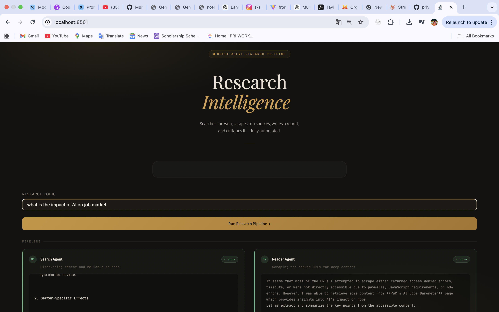
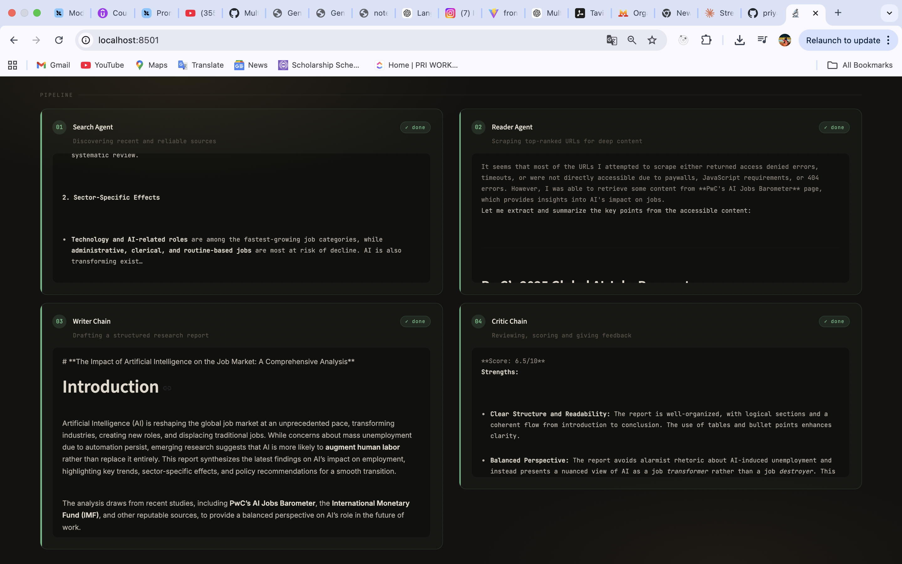
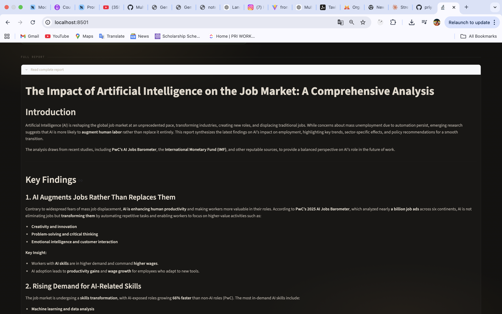
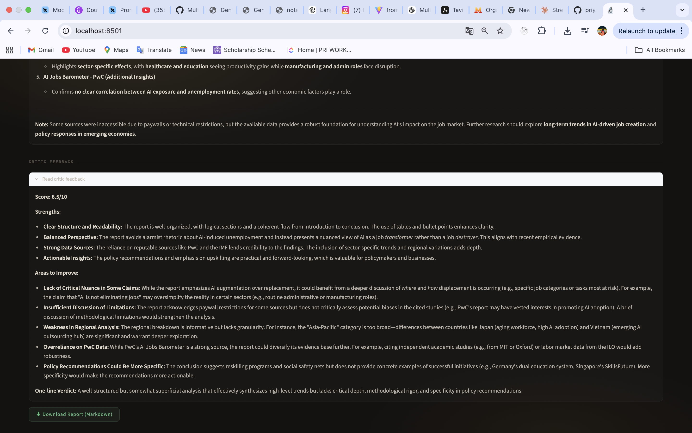

# 🔬 Research Intelligence — Multi-Agent Pipeline

A fully automated research pipeline built with **LangGraph**, **LangChain**, and **Mistral AI**. Enter any topic and four AI agents work in sequence to search the web, scrape top sources, write a structured report, and critique it — all inside a clean Streamlit UI.

---

## Architecture

```
┌─────────────────────────────────────────────────────────────┐
│                        User Input                           │x
│                    (research topic)                         │
└──────────────────────────┬──────────────────────────────────┘
                           │
                           ▼
┌─────────────────────────────────────────────────────────────┐
│               STEP 1 — Search Agent                         │
│           LangGraph ReAct Agent                             │
│                                                             │
│   ┌──────────────┐         Queries Tavily Search API        │
│   │  web_search  │◄──────  Returns titles, URLs, snippets   │
│   │    (tool)    │                                          │
│   └──────────────┘                                          │
└──────────────────────────┬──────────────────────────────────┘
                           │  search results
                           ▼
┌─────────────────────────────────────────────────────────────┐
│               STEP 2 — Reader Agent                         │
│           LangGraph ReAct Agent                             │
│                                                             │
│   ┌──────────────┐         Picks most relevant URL          │
│   │  scrape_url  │◄──────  Scrapes with requests +          │
│   │    (tool)    │         BeautifulSoup (3000 chars)        │
│   └──────────────┘                                          │
└──────────────────────────┬──────────────────────────────────┘
                           │  scraped content
                           ▼
┌─────────────────────────────────────────────────────────────┐
│               STEP 3 — Writer Chain                         │
│           LangChain LCEL  (prompt | llm | parser)           │
│                                                             │
│   Combines search results + scraped content                 │
│   Outputs: Introduction · Key Findings · Conclusion ·       │
│            Sources                                          │
└──────────────────────────┬──────────────────────────────────┘
                           │  draft report
                           ▼
┌─────────────────────────────────────────────────────────────┐
│               STEP 4 — Critic Chain                         │
│           LangChain LCEL  (prompt | llm | parser)           │
│                                                             │
│   Reviews the report and outputs:                           │
│   Score (X/10) · Strengths · Areas to Improve · Verdict     │
└──────────────────────────┬──────────────────────────────────┘
                           │
                           ▼
                 ┌─────────────────┐
                 │  Final Report   │
                 │  + Feedback     │
                 │  (downloadable) │
                 └─────────────────┘

              All agents powered by Mistral AI (mistral-small-latest)
```

---

## Features

- **4-stage agentic pipeline** — search → scrape → write → critique
- **Real-time UI** — step cards update live as each agent runs
- **Live status indicators** — running / done chips per step
- **Output previews** — each card shows a truncated preview of its output
- **Full report viewer** — expandable sections for the full report and critic feedback
- **One-click download** — export the complete report as a Markdown file
- **Warm dark UI** — charcoal + amber gold theme with high-contrast input fields

---

## Tech Stack

| Layer | Technology |
|---|---|
| LLM | Mistral AI (`mistral-small-latest`) |
| Agent framework | LangGraph (`create_react_agent`) |
| Chain framework | LangChain LCEL |
| Web search | Tavily Search API |
| Scraping | `requests` + `BeautifulSoup4` |
| UI | Streamlit |
| Environment | `python-dotenv` |

---

## Project Structure

```
MultiAgentSystem/
├── appUI.py          # Streamlit UI
├── pipeline.py       # CLI entry point (original)
├── agents.py         # Agent and chain definitions
├── tools.py          # web_search and scrape_url tools
├── .env              # API keys (not committed)
├── requirements.txt
└── README.md
```

---

## Setup

### 1. Clone and create a virtual environment

```bash
git clone https://github.com/your-username/MultiAgentSystem.git
cd MultiAgentSystem
python -m venv .venv
source .venv/bin/activate        # Windows: .venv\Scripts\activate
```

### 2. Install dependencies

```bash
pip install -r requirements.txt
```

Or with `uv`:

```bash
uv pip install -r requirements.txt
```

### 3. Set up API keys

Create a `.env` file in the project root:

```env
MISTRAL_API_KEY=your_mistral_api_key_here
TAVILY_API_KEY=your_tavily_api_key_here
```

Get your keys from:
- Mistral AI → https://console.mistral.ai
- Tavily → https://app.tavily.com

### 4. Run the app

```bash
.venv/bin/streamlit run appUI.py
```

---

## Requirements

```txt
streamlit
langchain
langgraph
langchain-mistralai
langchain-core
langchain-community
tavily-python
requests
beautifulsoup4
python-dotenv
rich
```

---

## How It Works

### Search Agent
A LangGraph ReAct agent equipped with the `web_search` tool. Given a topic, it queries Tavily's search API and returns titles, URLs, and content snippets for the top 5 results.

### Reader Agent
A second ReAct agent with the `scrape_url` tool. It reads the search results, picks the most relevant URL, and scrapes up to 3000 characters of clean text using BeautifulSoup (stripping scripts, styles, navs, and footers).

### Writer Chain
A LangChain LCEL chain (`prompt | llm | StrOutputParser`) that combines the search results and scraped content into a structured report with an introduction, at least 3 key findings, a conclusion, and a sources list.

### Critic Chain
A second LCEL chain that reviews the draft report and returns a score out of 10, a list of strengths, areas to improve, and a one-line verdict.

---

## Screenshots






---

## Usage — CLI mode

You can also run the pipeline without the UI:

```bash
.venv/bin/python pipeline.py
```

Then enter a research topic when prompted.

---

## License

MIT
